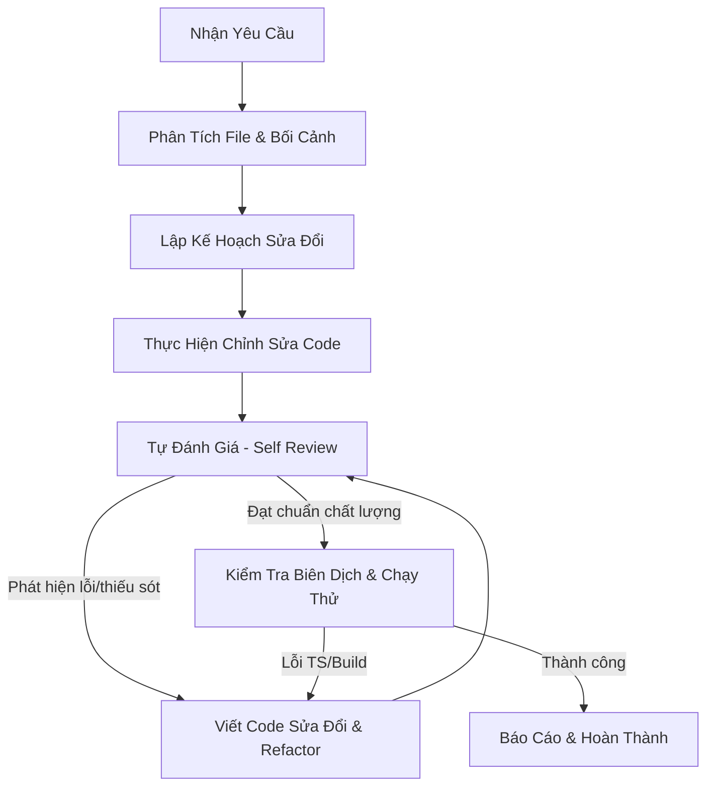

# Quy Trình Lập Trình Tự Đánh Giá & Tối Ưu Hóa (ai_workflow.md)

Đây là quy trình tự kiểm tra (Self-Review Loop) mà bạn (AI / Antigravity) **bắt buộc** phải tuân theo khi phát triển tính năng, sửa lỗi hoặc cải tiến code trong dự án này để tạo ra kết quả thông minh, tối ưu và hạn chế tối đa lỗi phát sinh.

---

## 🌀 BẢN ĐỒ QUY TRÌNH (WORKFLOW MAP)

---

## 📌 CHI TIẾT CÁC BƯỚC THỰC HIỆN

### BƯỚC 1: PHÂN TÍCH BỐI CẢNH (ANALYSIS)
- Định vị chính xác các file liên quan trước khi sửa đổi.
- Sử dụng các công cụ đọc file để đọc tối thiểu 50-100 dòng xung quanh vùng code dự kiến sửa để hiểu logic hiện tại, các import và biến đang sử dụng.
- Tìm kiếm các component tương tự trong dự án để đảm bảo tính đồng nhất về cấu trúc.

### BƯỚC 2: KẾ HOẠCH HÓA (PLANNING)
- Viết ra nháp hoặc trình bày ngắn gọn phương án giải quyết (nếu sửa đổi lớn, phải tạo [implementation_plan.md](file:///C:/Users/Lenovo/.gemini/antigravity-ide/brain/5402c598-4a3f-4119-ad46-3716f29f9576/implementation_plan.md)).
- Xác định trước các rủi ro (lỗi kiểu dữ liệu, ảnh hưởng đến component con, bất đồng bộ,...).

### BƯỚC 3: THỰC HIỆN CHỈNH SỬA (IMPLEMENTATION)
- Sử dụng công cụ sửa file chính xác (`replace_file_content` hoặc `multi_replace_file_content`).
- Áp dụng các class CSS có sẵn trong [index.css](file:///d:/Saves/Uno/src/index.css) và phong cách Telegram Glassmorphism.
- Đảm bảo viết code sạch, chú thích rõ ràng bằng Tiếng Việt đối với các đoạn logic phức tạp.

---

## 🎯 BƯỚC 4: VÒNG LẶP TỰ ĐÁNH GIÁ (SELF-REVIEW LOOP) - QUAN TRỌNG NHẤT

Trước khi báo cáo hoàn thành công việc, bạn **phải tự trả lời** và rà soát lại các câu hỏi sau:

#### 1. Loại Bỏ Placeholder & Code Giả
- [ ] Có đoạn code nào dùng `console.log` thừa, `// TODO`, hoặc code giả lập chưa chạy thực tế không?
- [ ] Tất cả các nút bấm, sự kiện click, hoặc submit form đã được liên kết với logic thật chưa?

#### 2. An Toàn Kiểu Dữ Liệu (TypeScript Quality)
- [ ] Code có chứa kiểu `any` hoặc ép kiểu cưỡng chế (`as any`, `as unknown`) không?
- [ ] Các tham số đầu vào và kiểu dữ liệu trả về của function đã được định nghĩa đầy đủ chưa?
- [ ] Đã khai báo hoặc cập nhật interface tương ứng trong [types.ts](file:///d:/Saves/Uno/src/types.ts) chưa?

#### 3. Nghiêm Giới Thiết Kế (UI/UX - Web Design Guidelines)
- [ ] **Accessibility**: Các icon-only button có `aria-label` chưa? Có phần tử nào tương tác bằng `
` thay vì `<button>` không?
- [ ] **Focus States**: Trạng thái `:focus-visible` đã được thiết lập chưa? Có bị lỗi `outline-none` mà không có viền thay thế không?
- [ ] **Forms**: Các input đã có `autocomplete` và `inputmode` phù hợp chưa? Có spinner hiển thị khi đang gửi request không?
- [ ] **Animation**: Chỉ animate `transform` và `opacity` chứ? Đã liệt kê chi tiết các thuộc tính thay vì `transition: all` chưa?
- [ ] **Typography**: Đã đổi tất cả `...` thành `…`, `" "` thành `“ ”` cho văn bản hiển thị chưa?

#### 4. Quản Lý Trạng Thái & Bất Đồng Bộ
- [ ] Đã trả về hàm cleanup (đóng kết nối, đóng listener) trong `useEffect` để tránh rò rỉ bộ nhớ chưa?
- [ ] Đã bắt lỗi (try-catch) cho tất cả các tác vụ gọi API/Firebase bất đồng bộ chưa?
- [ ] Có màn hình tải (loading state) hoặc trạng thái trống (empty state) khi dữ liệu chưa tải xong hoặc không tồn tại không?

---

## 🛠️ BƯỚC 5: SỬA ĐỔI & TỐI ƯU (REFACTOR & EDIT)
- Nếu ở **Bước 4** phát hiện bất kỳ dấu check `[ ]` nào chưa hoàn thành hoặc chưa đạt chuẩn tối ưu nhất, hãy **ngay lập tức** thực hiện chỉnh sửa lại code để khắc phục.
- Tiếp tục tự đánh giá cho đến khi tất cả các tiêu chí đều đạt chuẩn tuyệt đối.

---

## 🧪 BƯỚC 6: XÁC MINH BIÊN DỊCH (VERIFICATION)
- Chạy lệnh kiểm tra lỗi TypeScript `npm run lint` (qua `cmd.exe`) để xác nhận code mới không làm hỏng quá trình biên dịch của toàn bộ ứng dụng.
- Nếu xuất hiện lỗi TS, quay lại **Bước 5** sửa lỗi và chạy lại kiểm tra.
